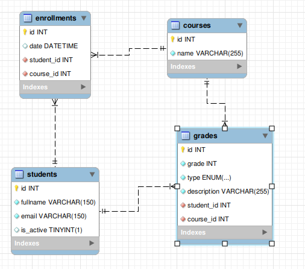

# Riwi Academy

## Pasos para ejecutar el proyecto
1. De la carpeta `resources/` en el archivo `db.sql`, **copiar el SQL** para levantar la base de datos.
2. Ejecutar la función `main` con el botón que provee Intellij al lado de la misma para después configurar los parametros del CLI.

> [!NOTE]
> Es normal que se levante una excepción al intentar conectarse a la base de datos.

   

4. Configurar los parametros del CLI. No olvides hacer click en "Aplicar".

   

5. Ejecutar de nuevo la función `main`.

## Modelo Relacional

